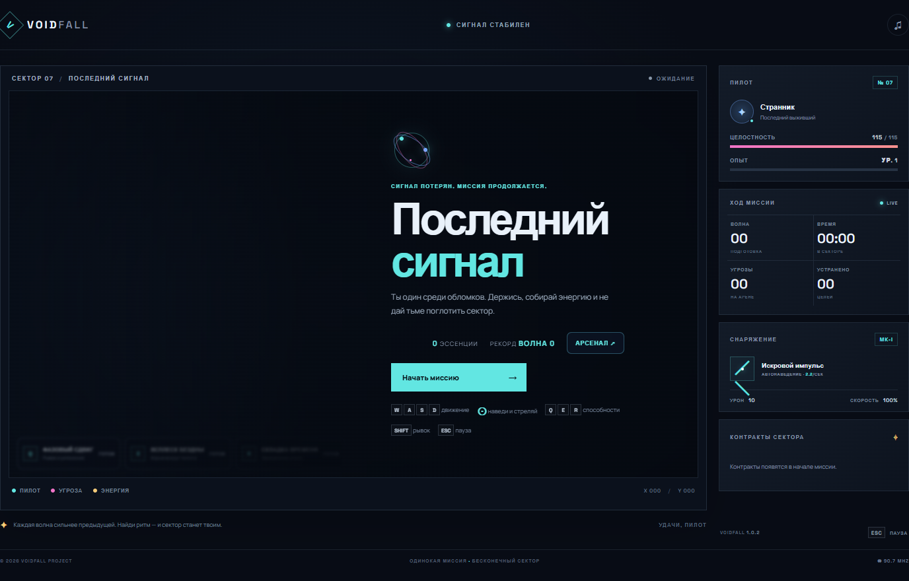

# GhosTnever — официальный сайт проектов

Портфолио **GhosTnever**: браузерные игры, инструменты для авторов модов и утилиты для разработчиков. На странице есть ссылки на демонстрации, исходный код и опубликованные сборки.

## Сайт

- Портфолио: <https://ghostnever-lkm.github.io/>
- GitHub: <https://github.com/GhosTnever-lkm>
- План разработки: <https://github.com/users/GhosTnever-lkm/projects/2/views/1>

## Обновление версии

Текущая версия указана в `VERSION`, история изменений — в `CHANGELOG.md`. GitHub Actions публикует содержимое ветки `main` в GitHub Pages.

Страница содержит canonical URL, метаданные на русском языке, ProfilePage/Person structured data, `robots.txt` и `sitemap.xml`. Эти сведения помогают поисковикам обнаружить и понять страницу, но не гарантируют сроки индексации или позицию в поиске.

Сайт статический, не собирает данные посетителей и не требует серверной части.

## Превью VOIDFALL

Снимок сделан в опубликованной браузерной версии игры. Открыть игру: <https://ghostnever-lkm.github.io/voidfall/>.

## ☕ Support / Pro Version

Поддержать проекты GhosTnever можно на [Boosty](https://boosty.to/azizazimov), [Buy Me a Coffee](https://buymeacoffee.com/azizazimov8) или [Gumroad](https://azimovian22.gumroad.com/). Отдельной платной версии сайта нет; платные дополнения доступны на страницах проектов, где они опубликованы.

Сайт распространяется по лицензии MIT. Условия для сторонних проектов и материалов указаны в их собственных репозиториях.
